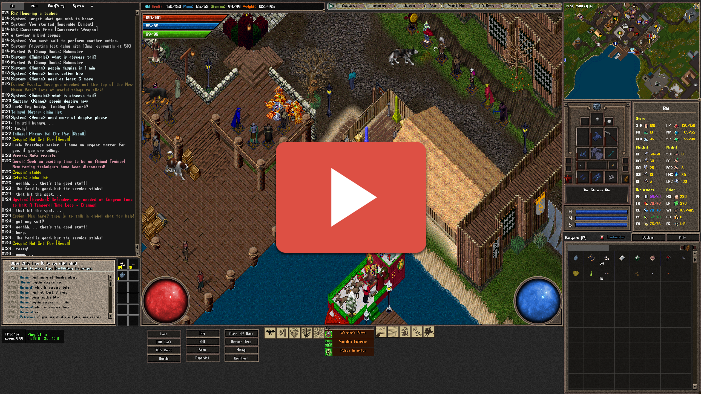

Hello Everyone. Thanks for stopping by to check out my stuff.

*Fiddle Me This* is a collection of custom art and custom gumps for Ultima Online created by myself for personal use, but also to share with the community. The name Fiddle Me This is just a play on "Riddle Me This" from Batman - but with the tie in being that there is a program called UO Fiddler that allows you to look at, edit and extract art assets from .mul files that Ultima ONline uses.

My work is intended to be used with TUO(TazUO) which is a fork/modified version of CUO(ClassicUO). This version of the client has a PNG Overrides folder, allowing you to simply drop images into a folder and they will load into the game. This is much easier and cleaner than editing or patching .mul files. My files *can* be used with those patchers and such, if you know how to do so, and I may support this later - but for now they are meant to simply be downloaded and extracted into the TUO main directory (which will drop files into the externalimages (the override folder) and also Data/XmlGumps (for custom gumps).

**You'll notice two folders as discussed below:**

**Custom:** This folder contains art and XML files used for "Custom Gumps" such as custom Status Bars or HP/MP bars, etc.

**Original:** This folder contains only art that is used to override "original" art for gumps within UO

The *Excel File* titled "Art ID List" is a list of all the art IDs I have used (and others that will be used in the future). This list can help you find a particular art in case you want to edit it yourself or need to find it within an XML file. This currently only includes art IDs for my custom gump art. I will be updating this list later to include helping descriptions of all the other art in my pack, so you can easily know what they are for.

# Instructions

These folders are structured the same way your TazUO installation would be already. To install simply drop the files into your root TazUO folder. Folders affected are TUO/Data/XmlGumps and TUO/ExternalImages where TUO is your TazUO installation directory.

***IMPORTANT*** If you have a resolution lower than 2560x1440, you may need to modify some custom gump starting positions for the gump to appear. When I create these gumps I set them up for my own game, and since I run 1440p, sometimes the gump may be off the screen for someone with a lower resolution. You can fix this by going to the **<gump** tag at the start of the gump's XML file. You will find X and Y positions there, which you can modify (or just put 0 in both). Once you get the gump working you can figure out what starting position you want for the gump, and change those values.

**Screenshot showing some, but not all of the custom gumps and custom art (will update later)**

***Control Click*** **below to see a video of of some of the stuff in action**

# Custom Gumps Included

## Health and Mana (Diablo Inspired) 

Designed to be in the corners of your gameplay window. Style matching the rest of my UI art. You can disable the corner pieces, as well as switch which side the corner piece is on.

## Larger Health, Mana, Stamina Bar - Default Style

As I get older, my eyes get worse. Playing Ultima Online in 1440p is a real chore on the eyes. CUO/TUO have made many improvements, but there are a lot of gumps and elements that are just tiny when played in 2k or 4k. This is simple the default Health, Mana and Stamina bar but increased size. THe image on the left is the "default" size (again, updated one with my style art) and then the one on the right is the custom gump which is enlarged. Currently only poison is supported on the HP section of the bar, but this will be updated by Taz in TUO at some point.

## Stacked Health, Mana, Stamina Bar - Modern Style

This is simply another more modern style Health, Mana, and Stamina bar. Designed to go in the upper corner of the window. Currently only poison is supported on the HP section of the bar, but this will be updated by Taz in TUO at some point.

## Character Status - Vertical

This is a reworking of the extended status gump. Reworked to be vertical which can easily fit more layouts that people are using. All the colors can of course be edited. The Icons are seperate images so you can update them to your liking. You can also hue all or some of the icons or even remove the icons, to customize your menu.

   
*Dragon icon in header image not drawn by me. I just added the text and some effects. Original image from Coin Icons which I purchased from <a href="https://graphicriver.net/item/coins-icons/20275714/">Graphic River</a>.
